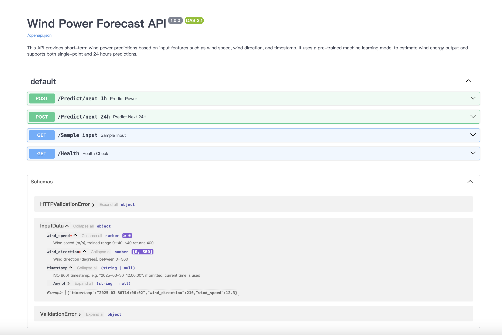
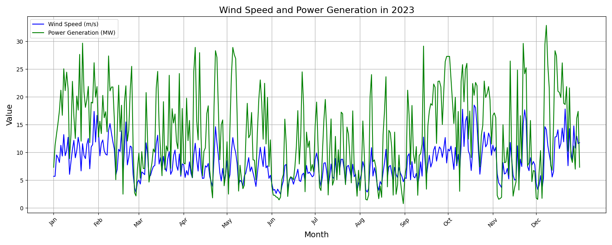
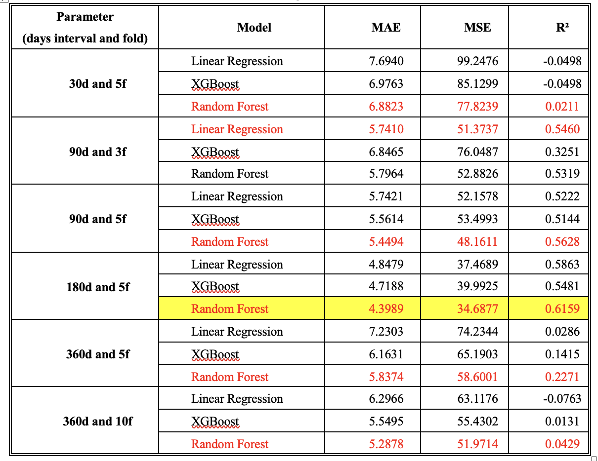
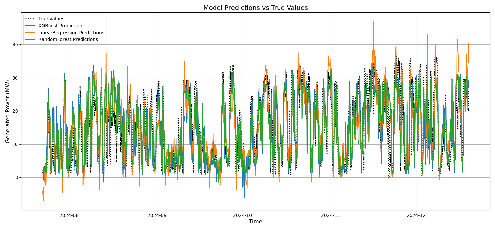
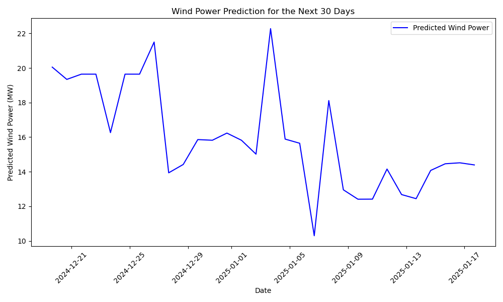

# Wind Power Forecasting API for Orkney

The **Orkney Islands**, located in Northern Scotland, have significant wind and marine energy resources. Local farms can utilize wind power for energy generation. This app aims to use weather forecasting data to predict energy production for Orkney.

This project is a RESTful API for predicting wind power using a trained **Random Forest** model. Built with **FastAPI**, it is deployed on an **AWS EC2**, and provides an interactive **Swagger UI** for easy testing. 

It follows a classical ML process, MLflow provides experiment tracking and model versioning, separating model training, experiment tracking, and inference serving into clearly defined components.


## 🌐 Live Demo

You can access the live API via:

👉 http://13.60.68.102/docs




## 📌 Available Endpoints

- **POST /predict**  
  Predict wind power for next 1 hour or based on user-provided input.

- **POST /predict/next-24h**  
  Predict wind power output for the next 24 hours or based on user-provided input.

- **GET /sample-input**  
  Returns a sample input format for testing.

- **GET /health**  
  Health check endpoint to verify API status.

## ⚙️ Tech Stack

- **Backend**: FastAPI (Python)
- **ML Models**: XGBoost, Linear Regression, Random Forest *(best performance and selected for deployment)*
- **Deployment**: AWS EC2(Ubuntu)
- **Documentation**: Swagger (via FastAPI’s auto-generated docs)
- **ML Ops Tools**: MLflow, Pandas, Scikit-learn
- **CI/CD**:
  - Docker for containerization and environment consistency  
  - GitHub Actions for automatic deployment to AWS EC2 on each `git push`


## 🌍 Data Sources

- **Wind power generation**:  
  [Scottish and Southern Electricity Networks (SSEN)](https://www.ssen.co.uk/)

- **Weather forecasts**:  
  [UK Met Office](https://www.metoffice.gov.uk/)


## 🤖 Model Training

The project uses traditional machine learning models from Scikit-learn to train on historical wind power and weather data:

- Linear Regression  
- XGBoost  
- Random Forest  

### Features used for training:

- Windspeed  
- Wind direction  
- Month  
- Day of the week  
- Hour  

## 📊 Experiment Tracking with MLflow

The training process is fully tracked using MLflow, enabling reproducibility and comparison across experiments.

MLflow is used to:
- Track experiment configuration:
- Data window size
- Cross-validation splits
- Feature preprocessing steps
- Log evaluation metrics for each model
- Store trained model artifacts
- Register the best-performing model in the MLflow Model Registry

This allows systematic comparison between different models and parameter settings without manual bookkeeping.


## 🏆 Model Selection & Observation

After training multiple models with varying parameters (30–365 day intervals and 3–10 time series splits), **Random Forest** performed best with:

- **180-day data interval**  
- **5-fold time series split**

The final model automatically retrieves and trains on the past 180 days of Orkney's wind power + weather data, and predicts the next **30 days** of generation.

## 📈 Main Results

<div style="display: flex; justify-content: center; align-items: center; flex-direction: column;">

windspeed and windpower visualizaion

 


wind direction and windpower visualizaion

    


metrics

  


model trained

  


prediction with the best model

    
</div>

## 🧪 How to Run the Code and Train Models Locally

This program supports two main functionalities: **model training** and **prediction**.

1. Create the virtual environment:

   ```bash
    python -m venv .venv
    source .venv/bin/activate
    pip install -r fastapi-app/requirements.txt
   ```

2. To train a model:

   ```bash
   mlflow run . --experiment-name windModel
   ```

   or

   ```bash
   python trainModel.py
   ```

3. To make predictions using the trained model:

   ```bash
   python predictWindpower.py
   ```


