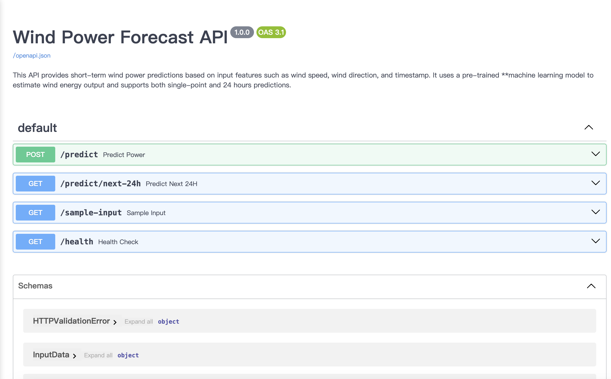

This project is a RESTful API for predicting wind power using a trained RandomForest model. Built with FastAPI, it is deployed on an Azure Virtual Machine and provides an interactive Swagger UI for easy testing.

The Orkney Islands, located in Northern Scotland, have significant wind and marine energy resources. Local farms can utilize wind power for energy generation. This app aims to use weather forecasting data to predict energy production for Orkney.

You can access the live API via:
http://20.234.40.109:8000/docs#/

&nbsp;&nbsp;&nbsp;&nbsp;

- Available Endpoints
	- POST /predict:  
Predict wind power based on user-provided meteorological input.
	- GET /predict/next-24h: 
Predict wind power output for the next 24 hours.
	- GET /sample-input:  
Returns a sample input format for testing.
	- GET /health:  
Health check endpoint to verify API status.

- Tech Stack
	- Backend: FastAPI, Python
	- ML Models: XGBoost, Linear regression, Random Forest(best performance and selected for deployment)
	- Deployment: Azure Virtual Machine (Ubuntu), Docker
	- Documentation: Swagger (via FastAPI’s auto-generated docs)
	- Others: MLflow, Pandas, Scikit-learn

- How to run the code and train models by yourself: 
  - The program includes two main functionalities: model generation and prediction using the model.
  - First run: "conda env create -f conda_env.yaml" to build the enviromant after download the code. 
  Then run "conda activate windpower_prediction_Orkney" to activate the environment.
  - Model generation: Run the following command in the terminal:  "mlflow run . --experiment-name windModel" or "python trainModel.py"
  - Prediction using the model: Run the following command in the terminal:  python predictWindpower.py
  
- Data Sources:
  - Orkney’s renewable power generation: Sourced from Scottish and Southern Electricity Networks (SSEN).
  - Weather forecasts for Orkney: Sourced from the UK Met Office.

- Model Training:
The project uses traditional models from scikit-learn to train wind power prediction models. Specifically, it includes:
  - Linear Regression
  - XGBoost
  - Random Forest

- Training Features:
  - Windspeed
  - Wind direction
  - Month
  - Day of the week
  - Hour

- Observations from Model Training:
After training 6 models for several times by adjusting data interval among 30 to 365 days, timeseries split from 3 to 10 folds, the Random Forest Model preforms better in 180 days and 5 folds.

- Prediction Model:
The selected model for predictions is Random Forest, configured with:
  - 180-day interval
  - 5 folds

Each run automatically retrieves the past 180 days of Orkney’s renewable power generation and weather forecast data for training. Using data from the past 180 days, it predicts wind power generation for the next 30 days.

- Main Results:

windspeed and windpower visualizaion

 

wind direction and windpower visualizaion

    

metrics

  

model trained

  

prediction with the best model

    

